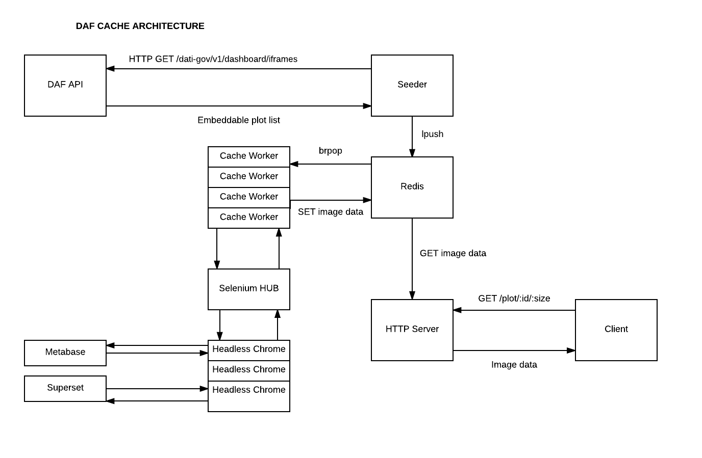

# daf-cacher
[](https://developersitalia.slack.com/messages/C7X6L03C6/)
 [](https://slack.developers.italia.it/)
 
A microservice to cache DAF plots

This microservice is used by [daf-dataportal](https://github.com/italia/daf-dataportal),
iterates over the various plots, takes a screenshot, and caches them.


## Build status

[](https://travis-ci.org/italia/daf-cacher)

## Architecture




## Features

* Easy to scale thanks to producer/consumer architecture backed by redis 
* It generates for each plot a customizable set of different thumbs size
* Embedding cached image in the page is easy as

 ```html

```
Es:

```html

```

* New public plots are discovered and cached automatically

## Components

* API

It is used to serve cached images to the client

* Seeder

A recurring task would go through each available public plot by pinging DAF API and it will enqueue a new caching job

 
* Worker

Responsible to perform screenshot and thumbs, consuming jobs enqueued by the Seeder

## How to run locally with docker compose:

* Make sure to have a valid https://bi.daf.teamdigitale.it account
* Make sure to have a valid https://dataportal-private.daf.teamdigitale.it account
* Make sure to have a jdk8 installed
* Make sure to have a modern maven version installed
* Copy ```config.properties.example``` to ```config-docker.properties``` and edit it accordingly
* Compile it with:

```
$ mvn clean dependency:copy-dependencies  package -Dmaven.test.skip=true
```

* Build the container with:
```
$ docker build -t italia/daf-metabase-cacher .
```

Run with:
```
$ docker-compose up
```

Once the service is up, a POC will be available at http://localhost:4567/


